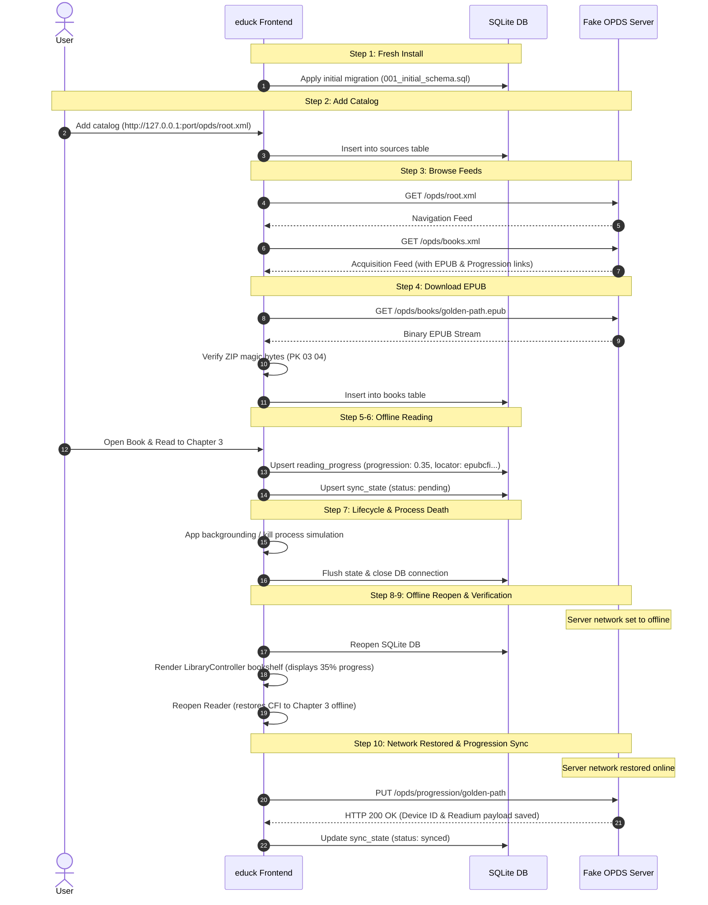

# End-to-End Golden Path Testing & Fake OPDS Server

This document describes the automated End-to-End (E2E) testing architecture, the standalone Fake OPDS & Progression Server, and the 10-step Golden Path lifecycle test suite for `educk` (Milestone M17).

---

## 1. Overview

Milestone M17 introduces full system-level integration and lifecycle validation across all architectural tiers:
- **OPDS 1.2 Catalog Client & Navigation**: RFC 4287 Atom XML feeds, relative URL resolution, Dublin Core metadata, and OPDS acquisition / progression link extraction.
- **Persistent Data Layer**: SQLite database (`NodeSqliteDatabase` running `001_initial_schema.sql`) enforcing foreign keys, transactions, and crash durability.
- **Download Engine & Filesystem**: Direct binary stream consumption from HTTP sockets, atomic `.part` staging, ZIP archive integrity verification, and SQLite registration.
- **Local Library Bookshelf**: Offline rendering of downloaded books, reading progress indicators, and event delegation.
- **Reading Progress Tracking**: CFI locator persistence (`epubcfi(...)`), debounced storage, and background flush.
- **Mobile Lifecycle & Crash Durability**: Application backgrounding, process termination, and offline restart without data corruption.
- **OPDS Progression 1.0 Synchronization**: Readium-compliant REST `PUT`/`GET` synchronization with device tracking headers (`X-Device-Id`), offline queue management, exponential backoff retries, and conflict resolution.

---

## 2. Fake OPDS 1.2 & Progression 1.0 Server

### Architecture (`tests/e2e/opds-server/fake-opds-server.ts`)
The test server is implemented using Node's native `node:http` module and binds to `127.0.0.1:0`. By requesting port `0`, the operating system dynamically assigns an open ephemeral port, completely eliminating port collisions across parallel test runners and CI agents.

### Server Endpoints

| Endpoint | Method | Content-Type | Description |
| :--- | :--- | :--- | :--- |
| `/opds/root.xml` | `GET` | `application/atom+xml` | Root navigation feed with subsection links to categories and acquisition feeds |
| `/opds/categories.xml` | `GET` | `application/atom+xml` | Category navigation feed |
| `/opds/books.xml` | `GET` | `application/atom+xml` | Acquisition feed with entry metadata, EPUB link, progression link, and cover image |
| `/opds/books/golden-path.epub` | `GET` | `application/epub+zip` | Binary stream of valid EPUB fixture (`fixtures/books/valid-sample.epub`) |
| `/opds/covers/golden-path.jpg` | `GET` | `image/jpeg` | Sample JPEG image bytes |
| `/opds/progression/:bookId` | `GET` | `application/vnd.readium.progression+json` | Returns stored Readium JSON progression payload or 404 if not found |
| `/opds/progression/:bookId` | `PUT` | `application/json` | Accepts Readium JSON payload, parses body, tracks `X-Device-Id`, and stores progress |

### Fault Injection & Simulation Controls

```typescript
// Simulate complete network disconnection (destroys client socket)
fakeServer.setOffline(true);

// Simulate transient server failures with automatic recovery (e.g., for retry backoff tests)
fakeServer.setFailCount(2); // Fails the next 2 requests with HTTP 500, then recovers

// Pre-populate remote progression to simulate multi-device synchronization conflicts
fakeServer.setStoredProgression("book-id", remotePayload, "device-tablet");

// Inspect recorded requests
const requests = fakeServer.getRecordedRequests();
```

---

## 3. The 10-Step Golden Path Workflow

The Golden Path executes the complete user lifecycle from a pristine installation through offline reading and eventual cloud synchronization:



---

## 4. Edge Cases & Resilience Tests

### 4.1. HTTP 500 Retry with Exponential Backoff
- When `ProgressionClient` encounters a 500 Internal Server Error, it retries up to `maxRetries` times with exponential delay (`retryDelay * 2^attempt`).
- Verified with `fakeServer.setFailCount(2)`: client fails attempts 0 and 1, automatically retries, and succeeds on attempt 2 without failing the user experience.

### 4.2. Multi-Device Conflict Resolution
- When another device has read further (`remote.modified > local.modified` and `remote.progression = 0.75`), the client:
  - Detects the timestamp discrepancy.
  - On cold book open (`isColdOpen: true`), silently applies the newer remote progress (0.75).
  - Updates local SQLite `reading_progress` and transitions `sync_state` to `synced`.
